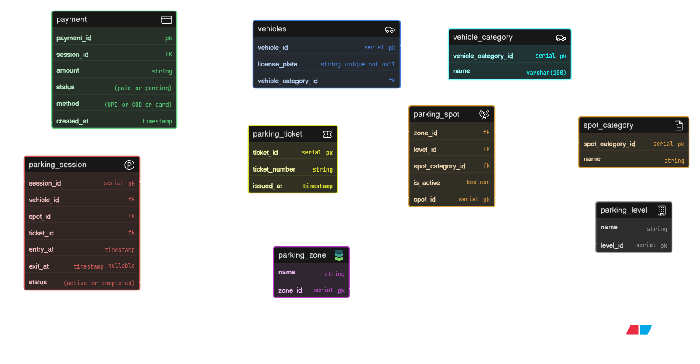

# Comic-Con Parking System (ER Design)

This project represents the database design for a multi-zone parking management system used during large-scale events like Comic-Con India.

The system is designed to handle high traffic of vehicles across different categories such as bikes, cars, SUVs, EVs, and cabs, while efficiently managing parking spots distributed across multiple zones and levels.

It supports allocation of parking spots based on vehicle type and reservation categories (VIP, exhibitors, staff, cosplayers, EV charging, etc.), and tracks complete parking sessions including entry, exit, ticket generation, and payment processing.

### Key Features

* Track vehicle entries and exits with timestamps
* Support multiple visits per vehicle
* Dynamic parking spot allocation
* Multi-zone and multi-level parking structure
* Reserved parking categories (VIP, staff, exhibitors, etc.)
* Real-time parking availability tracking
* Parking ticket generation per session
* Payment tracking and status management

### Core Entities

* Vehicle & VehicleCategory
* ParkingSpot, Zone, Level
* SpotCategory (Reservation Type)
* ParkingSession (entry/exit tracking)
* ParkingTicket
* Payment

